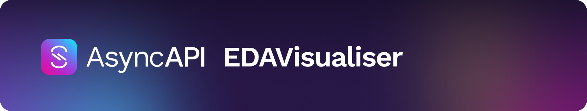
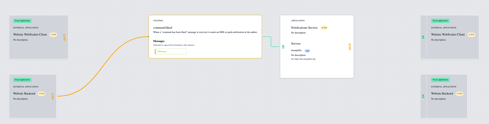
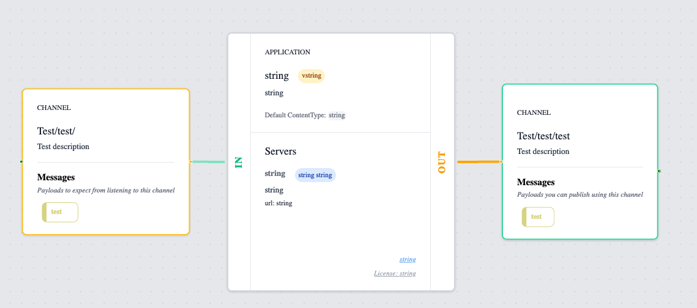
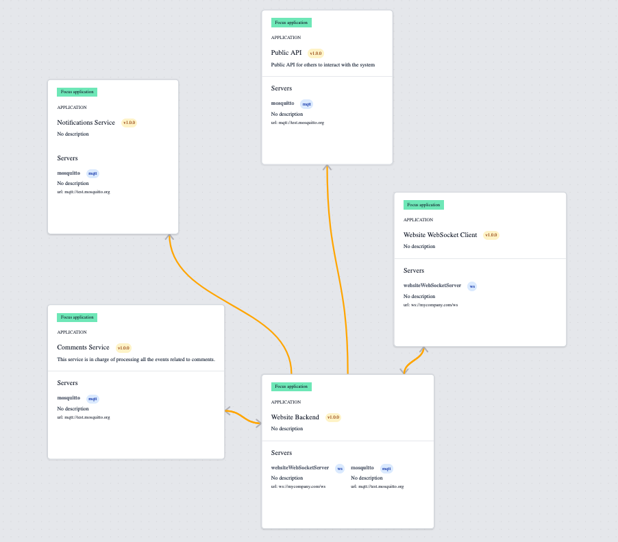

[](asyncapi.github.io/EDAVisualiser)

[](https://www.repostatus.org/#active)
[](https://www.npmjs.com/package/@asyncapi/EDAVisualiser)
[](https://github.com/asyncapi/EDAVisualiser/blob/master/LICENSE)
[](https://github.com/asyncapi/EDAVisualiser/commits/master)
[](https://asyncapi.github.io/EDAVisualiser) <!-- ALL-CONTRIBUTORS-BADGE:START - Do not remove or modify this section -->
[](#contributors-)
<!-- ALL-CONTRIBUTORS-BADGE:END -->

---

https://user-images.githubusercontent.com/13396189/169362612-0b6129b6-09b6-4807-aff9-8b545bcbc5dc.mp4

---

<!-- toc is generated with GitHub Actions do not remove toc markers -->

<!-- toc -->

- [EDAVisualiser](#edavisualiser)
  * [Installation](#installation)
  * [Inputs](#inputs)
  * [Views](#views)
    + [ApplicationFocusView](#applicationfocusview)
      - [**Configurations**](#configurations)
    + [ApplicationView](#applicationview)
      - [**Configurations**](#configurations-1)
    + [SystemView](#systemview)
      - [**Configurations**](#configurations-2)
  * [Showcases](#showcases)
  * [Contributors ✨](#contributors-%E2%9C%A8)

<!-- tocstop -->

# EDAVisualiser
EDAVisualiser is a visualization library to show various views revolving around your application. An Application is seen as something that communicates with others through incoming and outgoing "connections". This is what makes up the foundation for the views.  

It is written in React, however, it also supports the most used frameworks such as [Vue](./examples/vue/) and [Angular](./examples/angular/), check out the [examples](./examples/) for concrete code examples.

## Installation

Run this command to install the visualizer in your project:

```bash
npm install @asyncapi/edavisualiser
```

## Inputs
The library uses a domain-driven approach, meaning we don't assume one or the other input but build on top of a domain model that is specific to this problem we are trying to solve.

| Input | Example | Description|
|:---:|:---:|:---:|
| [**AsyncAPI**](https://www.asyncapi.com/) | <a href="https://asyncapi.github.io/EDAVisualiser/asyncapi">Preview</a>, <a href="https://github.com/asyncapi/EDAVisualiser/blob/main/examples/simple-react/src/SimpleAsyncapi.tsx">code</a> | *Allows you to reuse pre-parsed AsyncAPI documents from the [official AsyncAPI parser](github.com/asyncapi/parser-js), underneath it splits up the AsyncAPI document into the core building blocks. AsyncAPI v2.0 -> v2.5 is supported.* |
| **Core building blocks** | <a href="https://asyncapi.github.io/EDAVisualiser/">Preview</a>, <a href="https://github.com/asyncapi/EDAVisualiser/blob/main/examples/simple-react/src/SimpleApp.tsx">code</a> | *The core building blocks is the domain abstraction for inputs this is what any other input type is converted to.* |


## Views

A view could for example be how a ["system" of applications is related](https://asyncapi.github.io/EDAVisualiser/social-media), [how a single application relates to others](https://asyncapi.github.io/EDAVisualiser/social-media/application/notification_service), only the fantasy sets the limitations, and [feel free to propose new ideas](https://github.com/asyncapi/EDAVisualiser/issues/new)!

### ApplicationFocusView
Puts a single application in focus as part of a larger system. Used to figure out who is "connected" to the application.

<a href="https://asyncapi.github.io/EDAVisualiser/social-media/application/notification_service"></a>

#### **Configurations**

These are all the arguments you can use to configure the view.
| Arguments | Description | Value type | Default | 
|:---:|:---:|:---:|:---:|
| `application` | The core building block for setting the application information. | `ApplicationNodeData \| undefined` | `undefined` |
| `incomingOperations` | The core building block for setting incoming operations for the application. | `Array<IncomingNodeData> \| undefined` | undefined |
| `outgoingOperations` | The core building block for setting incoming operations for the application. | `Array<OutgoingNodeData> \| undefined` | undefined |
| `external` | This is the main difference from the `ApplicationView` as it shows how external applications interact with it. | `Array<ApplicationViewData> \| undefined` | undefined |
| `asyncapi` | If the application is to be loaded from a pre-parsed AsyncAPI document, which can extend the node with a custom react component in the top of the node. I.e., if you want to render a button or whatever it can be. | `AsyncapiApplicationData \| undefined` | undefined |
| `layout` | Used to customize the layout of nodes by setting their position. | `(elements: FlowElement[]) => React.JSXElementConstructor<LayoutProps> \| undefined` | A column layout (`ColumnLayout`) |
| `sideMenu` | Used to create a custom menu, or whatever you wish to display within the view on top of the nodes. | `() => React.JSXElementConstructor<any> \| undefined` | Simple headline with the library name |
| `includeControls` | Include controls to zoom in and out, focus and lock nodes. | `boolean \| undefined` | `false` |
| `edgeType` | Determine the type of edge between nodes. | Either `'smoothstep'`, `'step'`, `'straight'`, `'floating'`, `'default'`, `'simplebezier'`, `'animated'` | `smoothstep` 


### ApplicationView
Puts a single application in focus with only it's near connections that are incoming to the application or outgoing from it.

<a href="https://asyncapi.github.io/EDAVisualiser/"></a>

#### **Configurations**

These are all the arguments you can use to configure the view.
| Arguments | Description | Value type | Default | 
|:---:|:---:|:---:|:---:|
| `application` | The core building block for setting the application information. | `ApplicationNodeData \| undefined` | `undefined` |
| `incomingOperations` | The core building block for setting incoming operations for the application. | `Array<IncomingNodeData> \| undefined` | undefined |
| `outgoingOperations` | The core building block for setting incoming operations for the application. | `Array<OutgoingNodeData> \| undefined` | undefined |
| `asyncapi` | If the application is to be loaded from a pre-parsed AsyncAPI document, which can extend the node with a custom react component in the top of the node. I.e., if you want to render a button or whatever it can be. | `AsyncapiApplicationData \| undefined` | undefined |
| `layout` | Used to customize the layout of nodes by setting their position. | `(elements: FlowElement[]) => React.JSXElementConstructor<LayoutProps> \| undefined` | A column layout (`ColumnLayout`) |
| `sideMenu` | Used to create a custom menu, or whatever you wish to display within the view on top of the nodes. | `() => React.JSXElementConstructor<any> \| undefined` | Simple headline with the library name |
| `includeControls` | Include controls to zoom in and out, focus and lock nodes. | `boolean \| undefined` | `false` |
| `edgeType` | Determine the type of edge between nodes. | Either `'smoothstep'`, `'step'`, `'straight'`, `'floating'`, `'default'`, `'simplebezier'`, `'animated'` | `smoothstep` 

### SystemView
Puts the system/collection of applications in focus to figure out how they are all connected.

<a href="https://asyncapi.github.io/EDAVisualiser/social-media"></a>

#### **Configurations**

These are all the arguments you can use to configure the view.
| Arguments | Description | Value type | Default | 
|:---:|:---:|:---:|:---:|
| `applications` | A list of all the applications within your "system". | `Array<ApplicationViewData> \| undefined` | `undefined` |
| `layout` | Used to customize the layout of nodes by setting their position. | `(elements: FlowElement[]) => React.JSXElementConstructor<LayoutProps> \| undefined` | A circle layout (`CircleLayout`) |
| `sideMenu` | Used to create a custom menu, or whatever you wish to display within the view on top of the nodes. | `() => React.JSXElementConstructor<any> \| undefined` | Simple headline with the library name |
| `includeControls` | Include controls to zoom in and out, focus and lock nodes. | `boolean \| undefined` | `false` |
| `edgeType` | Determine the type of edge between nodes. | Either `'smoothstep'`, `'step'`, `'straight'`, `'floating'`, `'default'`, `'simplebezier'`, `'animated'` | `smoothstep` 

## Showcases
These are the use-cases and where this library is used that you can use as inspiration.

- AsyncAPI Studio, was where this library's components was [originally created and split out from](https://github.com/asyncapi/studio/pull/342). It uses this library to visualize AsyncAPI documents. 

Feel free to add your own projects that are using this library and why.

## Contributors ✨
Thanks go to these wonderful people ([emoji key](https://allcontributors.org/docs/en/emoji-key)):

<!-- ALL-CONTRIBUTORS-LIST:START - Do not remove or modify this section -->
<!-- prettier-ignore-start -->
<!-- markdownlint-disable -->
<table>
  <tbody>
    <tr>
      <td align="center" valign="top" width="14.28%"><a href="https://github.com/jonaslagoni"><br /><sub><b>Jonas Lagoni</b></sub></a><br /><a href="https://github.com/asyncapi/EDAVisualiser/commits?author=jonaslagoni" title="Code">💻</a> <a href="#ideas-jonaslagoni" title="Ideas, Planning, & Feedback">🤔</a> <a href="#maintenance-jonaslagoni" title="Maintenance">🚧</a> <a href="https://github.com/asyncapi/EDAVisualiser/commits?author=jonaslagoni" title="Documentation">📖</a> <a href="#example-jonaslagoni" title="Examples">💡</a></td>
      <td align="center" valign="top" width="14.28%"><a href="https://github.com/magicmatatjahu"><br /><sub><b>Maciej Urbańczyk</b></sub></a><br /><a href="https://github.com/asyncapi/EDAVisualiser/commits?author=magicmatatjahu" title="Code">💻</a> <a href="#ideas-magicmatatjahu" title="Ideas, Planning, & Feedback">🤔</a> <a href="#maintenance-magicmatatjahu" title="Maintenance">🚧</a></td>
      <td align="center" valign="top" width="14.28%"><a href="https://boyney.io/"><br /><sub><b>David Boyne</b></sub></a><br /><a href="https://github.com/asyncapi/EDAVisualiser/commits?author=boyney123" title="Code">💻</a> <a href="#ideas-boyney123" title="Ideas, Planning, & Feedback">🤔</a></td>
      <td align="center" valign="top" width="14.28%"><a href="https://github.com/ShashwatPS"><br /><sub><b>Shashwat Pratap Singh</b></sub></a><br /><a href="https://github.com/asyncapi/EDAVisualiser/commits?author=ShashwatPS" title="Code">💻</a></td>
    </tr>
  </tbody>
</table>

<!-- markdownlint-restore -->
<!-- prettier-ignore-end -->

<!-- ALL-CONTRIBUTORS-LIST:END -->

This project follows the [all-contributors](https://github.com/all-contributors/all-contributors) specification. Contributions of any kind welcome!

Special thanks to [@magicmatatjahu](https://github.com/magicmatatjahu) for the react setup that allows the library to be offered to all frontend frameworks, and to [@boyney123](https://github.com/boyney123) for the initial visualization code that [first appeared in the AsyncAPI studio](https://github.com/asyncapi/studio/issues/261).