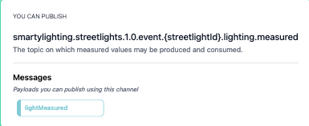

# Building blocks
Building blocks is where the business logic really lies and what display the elements.

## Application
The application is a single entity which data flows through, which means it has incoming and outgoing connections.

  

### Incoming
Incoming building blocks are used to show that something is going into the application. In some cases this can be a [Kafka topic](https://kafka.apache.org/intro#intro_concepts_and_terms) or a [NATS subject](https://docs.nats.io/nats-concepts/subjects) the application consumes or a HTTP request that application must handle.

  

### Outgoing
Outgoing, is well, the opposite of something going into the application, it is instead the application that interacts with someone else. In some cases this can be a [Kafka topic](https://kafka.apache.org/intro#intro_concepts_and_terms) or a [NATS subject](https://docs.nats.io/nats-concepts/subjects) the application produces to or a HTTP request that application sends.

  

