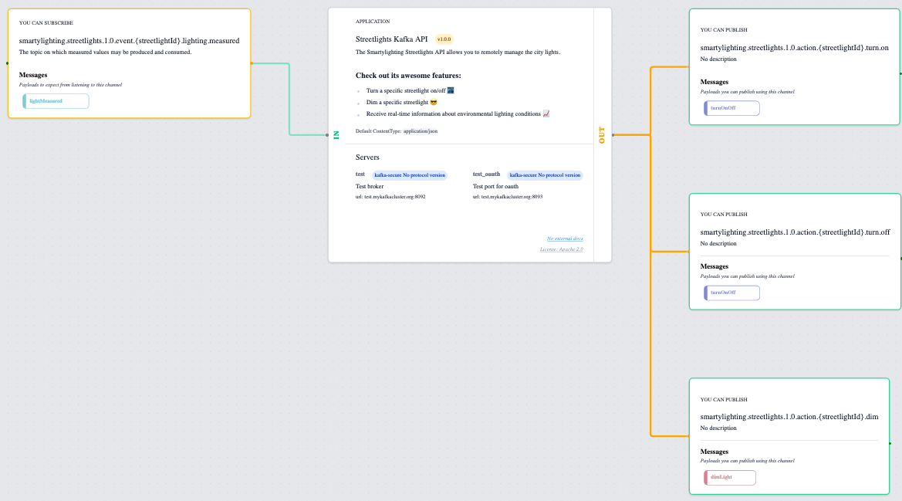

# Views
The [views](views.md) just wraps the building blocks into a specific use-case.

## ApplicationView
This view is centralizing everything around an application. What is sends and what it receives and who interact with it.

  

## SystemView
This view is focused on the larger picture, how applications interact with each other within a system.
